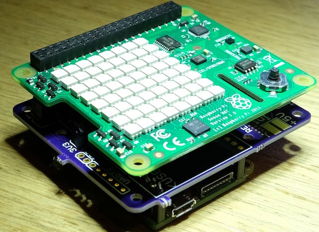
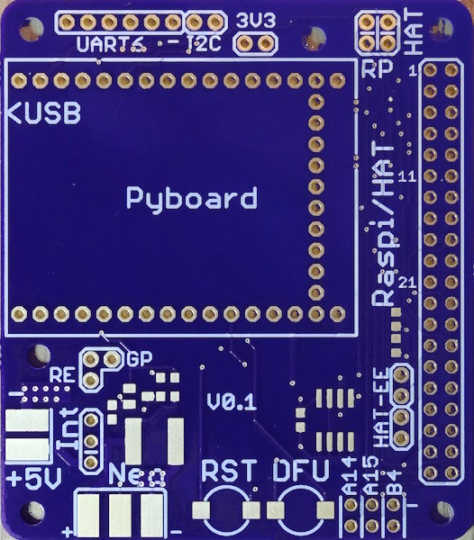

# Raspberry/HAT <-> Pyboard adapter

There's a large range of addon boards available for the raspberry pi (called "HAT") but not a lot for the micropython reference board ([Pyboard](https://micropython.org/store/#/products/PYBv1_1)). 

Using this adapter PCB it's possible to connect a PyBoard to a HAT extension board. HAT's are extension PCBs that plug into the 40pin connector of a raspberry Pi - they are cheap and a lot of them readily available by distributors (e.g. [Adafruit](https://www.adafruit.com/category/286)). So it would be a great addition to the MicroPython environment if they can be reused by the Pyboard!

While the main intention was to use existing HAT's where the pyboard acts like a raspberry, it's also possible to use the board the other way round: The  pyboard can then talk to a raspberry and emulate a HAT device.

## Physical
Example stackup: SenseHat on top of Interface board (pink). Pyboard sits below interface board but can also be placed on top of it if space is sufficient.



## What's a HAT?
Specification of the HAT's are [here](https://github.com/raspberrypi/hats).

In short, they must fulfill the mechanical dimensions provided and contain an I2C EEPROM with information about the serial number, GPIO setup and linux device tree. At boot time, the raspberry checks this configuration and configures the GPIO accordingly. See [here](https://www.disk91.com/2015/technology/hardware/design-a-raspberry-pi-hat-shield/) of how an EEPROM image can be created.

In principle, a HAT can use most of the wires that the 40pin connector provides. However most HATs use the UART, SPI or I2C, together with some other GPIOs of the first 28 pins.

## Adapter PCB HW configurations
The adapter board allows to interface a pyboard with the 40pin header of a raspberry. 2 configurations are supported:

* attach a HAT to the 40pin connector and use the pyboard as master device. This means the pyboard acts like a raspberry and controls a HAT. Solder a 40pin MALE connecter to the top side of the adapter board.
* attach a Raspi to the 40pin connector and use the pyboard as slave device. It means the pyboard acts like a HAT and listens to commands from the raspberry. Solder a 40pin FEMALE connector on the bottom side of the adapter board.

In addition the adapter PCB contains:

* An I2C-EEPROM which can be useful if you want to develop a fully HAT compatible board with the pyboard. It's mandatory by the foundation that only an I2C EEPROM can be attached to pin 27/28, however it might be possible that the pyboard can act as I2C slave so the EEPROM becomes obsolete? That's one of the many questions that this adapter should help to answer.
* A FET driver circuit to drive external neopixel strips. The neopixel can be driven by the SPI output of the pyboard. There is a jumper that allows the supply of the neopixel to be applied externally (separate power supply) or internally (using the +5V USB).
* 2 buttons for RST and DFU -> so it's easy to update your pyboard firmware.
* (FTDI) Headers for UART/I2C access of the pyboard. So it's easy to debug and log outputs from the pyboard on the PC

## PCB



The outline follows the official requirements by the raspberry foundation. 

The pyboard can be placed above or below the board - depending on how you want to place the HAT or how you have mounted the headers on the pyboard. 

As a special feature, the area where the pyboard is socketed contains no VIA's. This way it's possible to solder the pyboard directly to the adapter board without causing a short.

It might be that a HAT will overlap the pyboard and there is not enought room in between. In that case it's preferred to place the pyboard on the bottom side.

The 40pin connector can either be a male type (in case you want to access a HAT) or a female type (if you use it as a HAT togehter with a raspi).

### GPIO connection
Most of the 40pin GPIOs and the most important interfaces (UART/SPI/I2C) are wired to the pyboard. The follwing table gives an overview:

| Pyboard Pin   | GPIO (pin)    |
| ------------- |:-------------:|
| X10           | SDA (3)       |
| X9            | SCL (5)       |
| Y4            | GPIO4 (7)     |
| X3            | GPIO17 (11)   |
| Y3            | GPIO18 (12)   |
| X4            | GPIO27 (13)   |
| Y11           | GPIO22 (15)   |
| Y12           | GPIO25 (16)   |
| X5            | GPIO24 (18)   | 
| Y8            | MOSI (19)     | 
| Y7            | MISO (21)     |
| X12           | GPIO25 (22)   | 
| Y6            | CLK (23)      | 
| Y5            | SS (24)       |
| X11           | GPIO7 (26)    | 
| Y10           | SDA_ID (27)   | 
| Y9            | SCL_ID (28)   | 
| LED_BLUE      | GPIO19 (35)   | 
| LED_YELLOW    | GPIO20 (38)   | 
| LED_GREEN     | GPIO21 (40)   |

See also the schematic for details.

I checked some commonly used HAT's and the setup above should allow to control most of them (most use only the first 28pins).

### Jumper configurations
#### HAT configuration (pyboard controls a HAT attached to the 40pin connector)
place the jumper as follows:


* JP5/JP6 (at the top left) vertically
* JP2 inserted (3V3 provided by Pyboard)

#### Raspberry configuration (pyboard acts like a HAT for a raspberry attached to the 40pin header)
place the jumper as follows:


* JP5/JP6 horizontally
* Attention: DO *NOT* insert JP2 (3V3 is given by the Raspberry)

#### Advanced options:
* Remote reset (raspberry can control reset line of pyboard): place JP4/JP1 vertically, otherwise horizontally (see also schematic for details). That might be a nice option if a raspberry was used to auto-test a pyboard?
* The pyboards internal LED states (the yellow/green/blue one) are available on the GPIO header pins 35,38,40. So a raspberry Pi can check if a reset is pending etc. Also that could be useful for automated test cases.

## How to use it
I've written [example uPy code](ideeprom.py) that should run on most HAT's. It reads out the ID EEPROM of the HAT (connected on I2C1) and interprets the data (vendor,product serial etc). I tested it with the SenseHat and it works ok.

I also added basic support for the [SenseHAT](https://www.raspberrypi.org/products/sense-hat/) (LED matrix, joystick, temperature and pressure readout) [here](sensehat.py).

Example usage (on serial REPL)
```python
MicroPython v1.5.1-303-gff1a96c on 2016-02-05; PYBv1.0 with STM32F405RG
Type "help()" for more information.
>>> import sensehat as s
>>> s.sense.get_temp()
23.41
>>> s.sense.get_pressure()
966.57
>>> s.sense.clear()     # clears the LED matrix
>>> s.sense.get_key()   # joystick pressed right
b'\x02'
>>> 
```

It would be nice to use the TFT HAT's but that's probably a bigger challenge and might needs c-level framebuffer support which is apparently in development.

## How to get it the board?
A first batch was manufactured at OSH Park and released as a shared project. You can order it [here](https://oshpark.com/shared_projects/iNvYGvMJ). Note that 3 boards cost around 54$ (it's a 4 layer design hence it's a more expensive than a 2 layer design)
