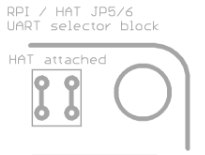

#Raspberry Pi to Pyboard adapter

The intention is to have an adapter that allows to control HAT's from the popular micropython Pyboard ([https://micropython.org/store/#/products/PYBv1_1]().  

HAT's are PCB's that plug into the 40pin connector of a raspberry Pi - they are quiet cheap and a lot of them readily available by distributors (e.g. Adafruit, see [https://www.adafruit.com/category/286]())

##Background - What's a HAT?
Specification of the HAT's are given by the foundation (see [https://github.com/raspberrypi/hats]()).

In short, they must fulfill the mechanical dimensions provided and contain an I2C EEPROM with information about the GPIO setup. At boot time, the raspberry checks this configuration and configures the GPIO accordingly. See [https://www.disk91.com/2015/technology/hardware/design-a-raspberry-pi-hat-shield/]() of how an EEPROM image can be created.

In principle, a HAT can use most of the wires that the 40pin connector provides. However most HATs use the UART, SPI or I2C, together with some other GPIOs of the first 28 pins.

##Adapter PCB
The adapter board allows to interface a pyboard with the 40pin header of a raspberry. 2 configurations are supported: 
* attach a HAT to the 40pin connector and use the pyboard as master device. This means the pyboard acts like a raspberry and controls a HAT.
* attach a Raspi to the 40pin connector and use the pyboard as slave device. It means the pyboard acts like a HAT and listens to commands from the raspberry.

The actual difference in the layout for these 2 versions are 
* rx/tx pins of UART are swapped
* 3.3V is applied / not applied. Attention: If a raspberry is used do NOT set JP2 (e.g. 3.3V must not be driven by the pyboard).

In addition the adapter PCB contains a fooprint for a I2C-EEPROM which can be useful if you want to develo a fully HAT compatible board with the pyboard. Maybe it's possible that the pyboard can act as I2C slave so the EEPROM becomes obsolete.

And as a small bonus it also contains a driver circuit for external neopixel strips (voltage converter and separate supply input). The neopixel can be driven by the SPI output of the pyboard.

Oh and it contains 2 buttons for RST and BOOT -> so it's easy to update your pyboard.

###Limitations
Not all 40pins are wired to the pyboard. The follwing table gives an overview:

| Pyboard Pin   | GPIO (pin)    |
| ------------- |:-------------:|
| X10           | SDA (3)       |
| X9            | SCL (5)       |
| Y4            | GPIO4 (7)     |
| X3            | GPIO17 (11)   |
| Y3            | GPIO18 (12)   |
| X4            | GPIO27 (13)   |
| Y11           | GPIO22 (15)   |
| Y12           | GPIO25 (16)   |
| X5            | GPIO24 (18)   | 
| Y8            | MOSI (19)     | 
| Y7            | MISO (21)     |
| X12           | GPIO25 (22)   | 
| Y6            | CLK (23)      | 
| Y5            | SS (24)       |
| X11           | GPIO7 (26)    | 
| Y10           | SDA_ID (27)   | 
| Y9            | SCL_ID (28)   | 
| LED_BLUE      | GPIO19 (35)   | 
| LED_YELLOW    | GPIO20 (38)   | 
| LED_GREEN     | GPIO21 (40)   |

I checked some commonly used HAT's and the setup above should allow to control most of them (most use only the first 28pins).

### Jumper configurations
####HAT configuration (pyboard controls a HAT attached to the 40pin connector)
place the jumper as follows:

* JP5/JP6 (at the top left) vertically
* JP2 inserted (3V3 provided by Pyboard)

####Raspberry configuration (pyboard acts like a HAT for a raspberry attached to the 40pin header)
place the jumper as follows:

* JP5/JP6 horizontally
* Attention: JP2 -> DO NOT insert <- (3V3 by Raspberry)

####Advanced options:
* Remote reset (raspberry can control reset line of pyboard): place JP4/JP1 vertically, otherwise horizontally
* The pyboards internal LED states (the yellow/green/blue one) are available on the GPIO header pins 35,38,40. So a raspberry Pi can check if a reset is pending etc.

